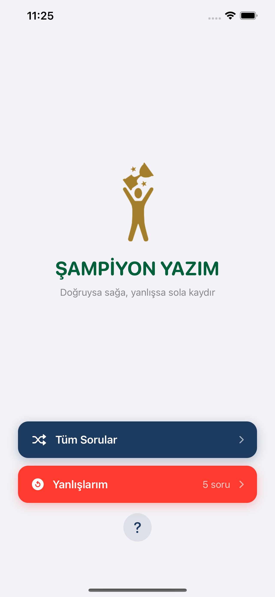
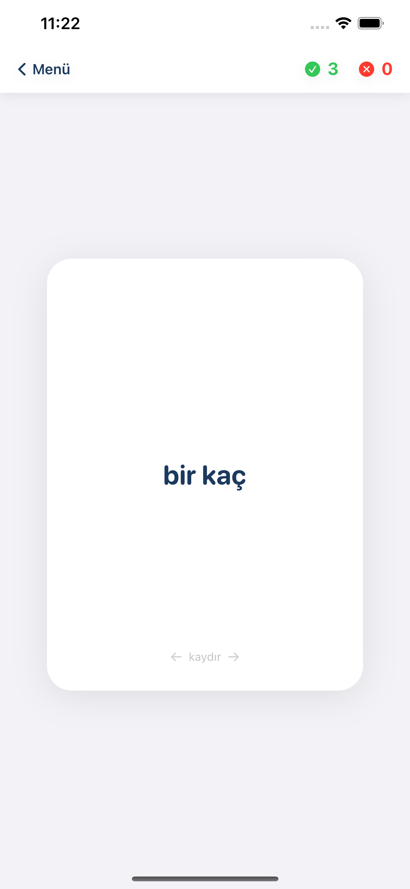
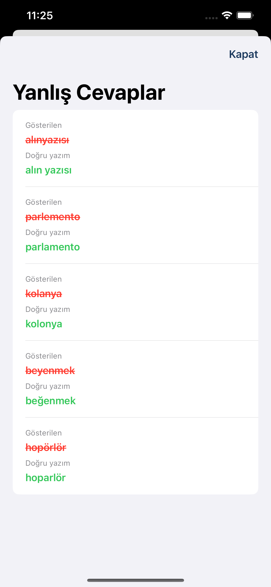

# Şampiyon Yazım

An iOS application designed to help Turkish university entrance exam students practice spelling rules through a simple, swipe-based learning experience.

## Overview

Şampiyon Yazım was developed as the first mobile product under the Şampiyon YKS initiative.

The application contains **800+ questions** based on spelling topics and past ÖSYM exam content, allowing students to practice frequently confused Turkish words through an interactive card-based interface.

## Key Features

## Screenshots

  
  
  

- 800+ spelling practice questions
- Swipe-based learning experience
- Content based on YKS / ÖSYM spelling topics
- Simple and mobile-first interface
- Published on the Apple App Store

## My Role

I took the product from idea to release, including:

- Product concept and feature planning
- Content structure and organization
- UI/UX decisions
- AI-assisted software development
- Testing and iteration
- App Store publishing process

## Development Approach

The application was built using an AI-assisted development workflow, allowing me to rapidly prototype, test, iterate, and ship a complete mobile product.

## Status

## App Store

✅ Published on the Apple App Store

[View Şampiyon Yazım on the App Store](https://apps.apple.com/tr/app/şampiyon-yazım/id6762749199)

## Related Project

Şampiyon Yazım is part of **Şampiyon YKS**, a broader EdTech initiative focused on creating digital learning products for university entrance exam students.
